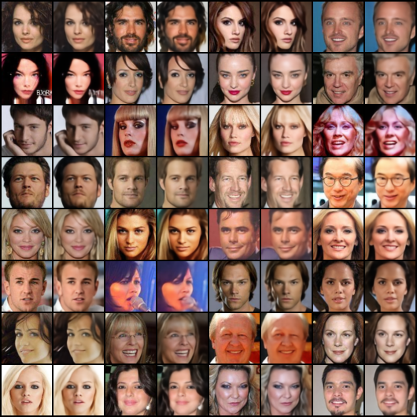
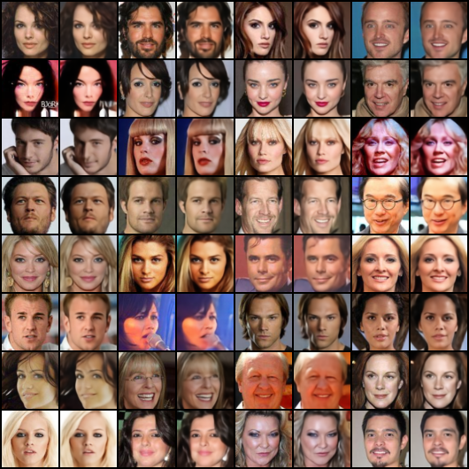

# visual-tokenizer-pytorch

Implement visual tokenizers with PyTorch.

<br/>

## Results

### CelebA(64x64)

**Quantitative results**:

<table style="text-align: center;">
<tr>
    <th style="text-align: center">Network arch.</th>
    <th style="text-align: center">Quantizer type</th>
    <th style="text-align: center">Codebook dim.</th>
    <th style="text-align: center">Codebook size</th>
    <th style="text-align: center">Codebook usage↑</th>
    <th style="text-align: center">Perplexity↑</th>
    <th style="text-align: center">PSNR↑</th>
    <th style="text-align: center">SSIM↑</th>
    <th style="text-align: center">rFID↓</th>
</tr>
<tr>
    <td style="text-align: center" rowspan="6"><a href="./models/autoencoder/simple_cnn.py">Simple CNN</a></td>
    <td style="text-align: center" rowspan="5">VQ loss</td>
    <td style="text-align: center">64</td>
    <td style="text-align: center">512</td>
    <td style="text-align: center">56.05%</td>
    <td style="text-align: center">243.6920</td>
    <td style="text-align: center">31.5486</td>
    <td style="text-align: center">0.9389</td>
    <td style="text-align: center">16.8227</td>
</tr>
<tr>
    <td style="text-align: center">64</td>
    <td style="text-align: center">1024</td>
    <td style="text-align: center">30.08%</td>
    <td style="text-align: center">247.6679</td>
    <td style="text-align: center">31.3835</td>
    <td style="text-align: center">0.9395</td>
    <td style="text-align: center">16.4965</td>
</tr>
<tr>
    <td style="text-align: center">64</td>
    <td style="text-align: center">2048</td>
    <td style="text-align: center">16.02%</td>
    <td style="text-align: center">277.0735</td>
    <td style="text-align: center">31.6631</td>
    <td style="text-align: center">0.9407</td>
    <td style="text-align: center">16.5808</td>
</tr>
<tr>
    <td style="text-align: center">16</td>
    <td style="text-align: center">512</td>
    <td style="text-align: center">68.55%</td>
    <td style="text-align: center">261.1088</td>
    <td style="text-align: center">31.6908</td>
    <td style="text-align: center">0.9412</td>
    <td style="text-align: center">16.4272</td>
</tr>
<tr>
    <td style="text-align: center">4</td>
    <td style="text-align: center">512</td>
    <td style="text-align: center">100.00%</td>
    <td style="text-align: center">431.3428</td>
    <td style="text-align: center">32.2119</td>
    <td style="text-align: center">0.9456</td>
    <td style="text-align: center">16.3249</td>
</tr>
<tr>
    <td style="text-align: center">EMA</td>
    <td style="text-align: center">64</td>
    <td style="text-align: center">512</td>
    <td style="text-align: center">100.00%</td>
    <td style="text-align: center">427.3798</td>
    <td style="text-align: center">32.0708</td>
    <td style="text-align: center">0.9459</td>
    <td style="text-align: center">15.5629</td>
</tr>
</table>

- Results are tested on 19962 images of CelebA test set.
- Codebook usage is calculated as the percentage of used codes in the queue of size 65536 over the whole codebook size.
- Perplexity is also calculated based on the queue of size 65536.

**Visualizations**:

<table>
    <tr>
        <th style="text-align: center">VQ loss (64 / 512)</th>
        <th style="text-align: center">EMA (64 / 512)</th>
    </tr>
    <tr>
        <td style="text-align: center"></td>
        <td style="text-align: center"></td>
    </tr>
</table>

It can be seen that the EMA codebook achieves better reconstruction quality and codebook usage than the VQ loss codebook.

<br/>

## Installation

Clone this repo:

```shell
git clone https://github.com/xyfJASON/visual-tokenizer-pytorch.git
cd visual-tokenizer-pytorch
```

Create and activate a conda environment:

```shell
conda create -n visual-tokenizer python=3.11
conda activate visual-tokenizer
```

Install dependencies:

```shell
pip install -r requirements.txt
```
